<!-- ═══════════════════════════════════════════════════════════════
     HERO  ·  圆角 banner (capsule-render type=rounded) + typing
     ═══════════════════════════════════════════════════════════════ -->

<picture>
  <source media="(prefers-color-scheme: light)" srcset="https://readme-typing-svg.demolab.com?font=Fira+Code&weight=600&size=22&duration=3200&pause=800&color=1F6FEB&center=true&vCenter=true&width=640&lines=%24+whoami+--verbose;%3E+Serenity-DMC;%3E+AI+Engineer+%2F%2F+from+scratch+to+silicon;%3E+CPU+%2B+OS+%2B+Compiler+%2B+Networking+%2B+...;%3E+keep+building%2C+keep+breaking" />
  
</picture>

<!-- ─── status bar ─────────────────────────────────────────────── -->

  
  
  
  

<h4>👋 Hello, I'm a passionate AI engineer from Chengdu, China.</h4>

 

<!-- ═══════════════════════════════════════════════════════════════
     ABOUT  ·  单栏排版，统一使用默认 
 边距
     ═══════════════════════════════════════════════════════════════ -->

<h2 align="center">🤺 <code>About Me</code></h2>

  嗨，我是 <b>Serenity-DMC</b>，一名 AI Engineer，来自成都。 
  热爱编程、读书、健身、摄影、徒步。

  想要自己「实现」一台计算机 —— 从零开始写 <b>CPU + 操作系统 + 编译原理 + 网络协议 + ……</b>

  我们正在让这个世界变得更加美好，通过代码的重复使用和延展构建完美体系。

  <em>We're making the world a better place — through constructing elegant hierarchies for maximum code reuse and extensibility.</em>

<pre>
┌──(serenity㉿dmc)-[~/world]
└─$ <b>cat ~/.profile</b>
   role     : AI Engineer
   stack    : Java · Python · TypeScript
   backend  : Spring Boot · Redis · MySQL
   focus    : CPU · OS · Compiler · Networking
   now      : building an AI Agent Harness
└─$ <b>_</b>
</pre>

 

<!-- ═══════════════════════════════════════════════════════════════
     STACK
     ═══════════════════════════════════════════════════════════════ -->

<h2 align="center">⌨️ <code>Tech Stack</code></h2>

  

  

 

<!-- ═══════════════════════════════════════════════════════════════
     STATS  ·  卡片由 .github/workflows/stats.yml 生成（静态 SVG）
     ═══════════════════════════════════════════════════════════════ -->

<h2 align="center">📊 <code>System Monitor</code></h2>

  <picture>
    <source media="(prefers-color-scheme: dark)" srcset="./profile/stats-dark.svg" />
    <source media="(prefers-color-scheme: light)" srcset="./profile/stats-light.svg" />
    
  </picture>
  <picture>
    <source media="(prefers-color-scheme: dark)" srcset="./profile/top-langs-dark.svg" />
    <source media="(prefers-color-scheme: light)" srcset="./profile/top-langs-light.svg" />
    
  </picture>

  <picture>
    <source media="(prefers-color-scheme: light)" srcset="https://streak-stats.demolab.com/?user=Serenity-2026&hide_border=true&background=FFFFFF&stroke=1F6FEB&ring=1F6FEB&fire=1F6FEB&currStreakLabel=1F6FEB&sideNums=24292F&currStreakNum=1F6FEB&dates=57606A&sideLabels=57606A" />
    
  </picture>

 

<!-- ═══════════════════════════════════════════════════════════════
     SNAKE  ·  由 .github/workflows/snake.yml 生成到 output 分支
     ═══════════════════════════════════════════════════════════════ -->

<h2 align="center">🐍 <code>./contributions --animate</code></h2>

  <picture>
    <source media="(prefers-color-scheme: dark)" srcset="https://raw.githubusercontent.com/Serenity-2026/Serenity-2026/output/github-snake-dark.svg" />
    <source media="(prefers-color-scheme: light)" srcset="https://raw.githubusercontent.com/Serenity-2026/Serenity-2026/output/github-snake.svg" />
    
  </picture>

